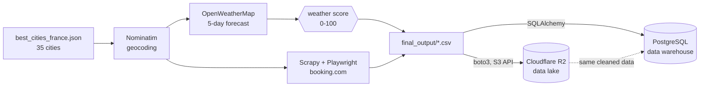
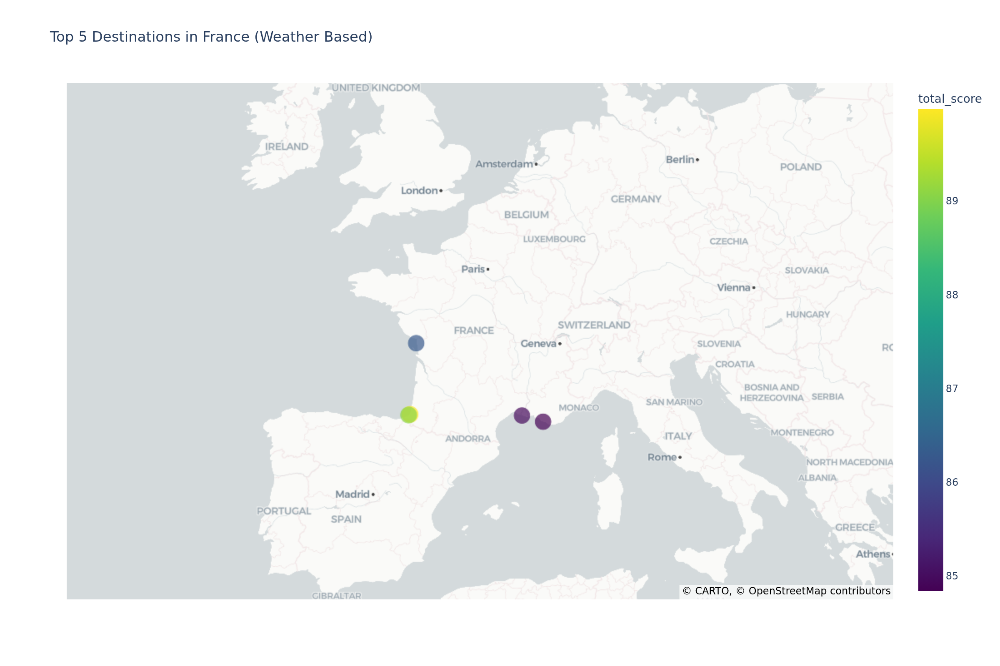
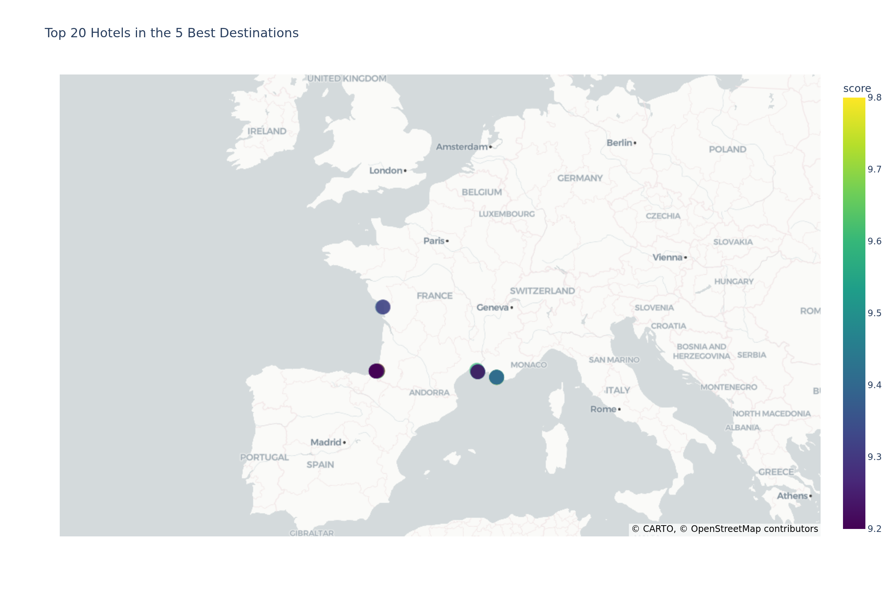

# Plan your trip with Kayak

Collect the weather and the hotels of 35 French cities, rank the destinations on the forecast,
and publish the whole thing to a data lake and a data warehouse.

Jedha *Full Stack Data Scientist* — **Block 1, Build & Manage a Data Infrastructure**.

## The problem

Kayak's marketing team found that **70% of their users planning a trip want more information about
the destination**, and that people distrust content whose source they do not know. They want to
recommend where to go next, backed by real data rather than editorial copy.

No such dataset exists internally, so the whole point of the project is the **collection chain**:
geocode the cities, pull the forecast, scrape the hotels, and make the result available to the
analysts who come next — first as raw files in a data lake, then as queryable tables in a
warehouse.

## Architecture



The three collection steps write a **CSV checkpoint** before moving on. That is not a convenience:
OpenWeatherMap's free plan is rate-limited, and a full Booking crawl takes 30 to 60 minutes for
~900 pages. Being able to replay everything downstream from the checkpoints is what makes the
pipeline demonstrable — and what makes a failure at step 4 cost seconds instead of an hour.

The lake and the warehouse hold **the same data, in the same state**. Both are overwritten on
every run: the lake because the CSV keys are stable, the warehouse because the load truncates
before inserting. Without that truncation the rows would silently pile up — the primary keys are
freshly generated UUIDs, so nothing would ever collide to stop it.

## Repository layout

```
kayak.ipynb                    the pipeline, end to end
booking_scraper_project/       Scrapy project — the booking.com spider
images/                        the two deliverable maps, exported as PNG
best_cities_france.json        the 35 cities of the assignment
*.csv, hotels.json             checkpoints, committed so the pipeline can be replayed
.env.example                   the credentials the notebook expects
```

## The weather score

Each city gets a 0-100 score per day, then cities are ranked on the **mean** of their daily scores
over the forecast window — so that one perfect day does not outrank five merely good ones.

| Metric | Target | Penalty | Weight |
|---|---|---|---|
| Temperature | 25 °C | −4 pts per degree away | 30 % |
| Rain volume | 0 mm | −5 pts per mm | 30 % |
| Rain probability | 0 % | −1 pt per % | 20 % |
| Wind | 0 km/h | −1 pt per km/h | 10 % |
| Cloud cover | 0 % | −1 pt per % | 10 % |

Rain carries half the total weight, split between how likely it is and how much falls. The
thresholds are a deliberate opinion about what a nice holiday looks like, not a meteorological
standard.

## Results

Run of 2026-08-16 — 35 cities, 210 daily forecasts, 859 hotels, no orphan foreign key.



Bayonne (90.0), Biarritz (88.8), La Rochelle (86.3), Saintes Maries de la Mer (85.0) and Cassis
(84.9). The ranking moves with the forecast: it is a snapshot, not a verdict on the cities.



The hotel map is restricted to those five destinations. Ranking hotels nationally would put the
best-rated ones hundreds of kilometres from anywhere the pipeline actually recommends.

## Deviations from the assignment

Four, all deliberate.

**The forecast covers 5 days, not 7.** The assignment points at OpenWeatherMap's One Call API,
which has since moved out of the free plan. The free `/data/2.5/forecast` endpoint returns 40
entries of 3 hours each — verified on this account: 40 readings spread over 6 calendar dates.
Nothing in the scoring depends on the window length.

**Hotels are searched for a stay 30 days out**, not tomorrow. Booking returns far more available
properties a month ahead, which yields a substantially richer dataset. The goal here is to
demonstrate the collection chain, not to book a real stay. *Choice validated with Jedha support.*

**The data lake is Cloudflare R2, not Amazon S3.** R2 implements the S3 API, so `boto3` is used
unchanged — only `endpoint_url` and `region_name="auto"` differ. What changes is the cost
structure: R2 bills no egress, which for a lake meant to be read repeatedly by an analytics team
is the dominant term. The assignment grades the infrastructure on simplicity, capacity and **cost**,
not on the vendor.

**The warehouse is a managed PostgreSQL, not AWS RDS.** Same role, same SQL, same SQLAlchemy code;
hosted in the EU. RDS has no free tier that survives a three-month project.

## RGPD

**No personal data is collected at any point.** The spider reads public listing pages and records
hotel names, booking URLs, coordinates, aggregate review scores and marketing descriptions — all
of it about businesses, none of it about people. Individual reviews, reviewer identities and user
accounts are never touched, and the pipeline requires no login.

Both stores are hosted in the European Union. Credentials live in a `.env` that git ignores, and
the R2 token is scoped to a single bucket with object-level rights only — it cannot even create a
bucket, which is why the notebook does not try to.

The crawl is deliberately slow: one request at a time, a randomised two-second delay, no
parallelism. It takes 30 to 60 minutes for the 35 cities, and that is the intended trade.

## Running it locally

```bash
python3 -m venv .venv
.venv/bin/pip install -r requirements.txt
.venv/bin/playwright install chromium   # the spider drives a real browser
.venv/bin/plotly_get_chrome             # kaleido needs Chrome to export the PNG maps
cp .env.example .env                    # then fill it in
```

Then run `kayak.ipynb` from the top. One step is deliberately **not** run from the notebook — the
Booking crawl:

```bash
cd booking_scraper_project
scrapy crawl booking_spider -O ../hotels.json
```

Streaming an hour of Scrapy output into a single notebook cell is what breaks the notebook↔kernel
channel. On 2026-08-16 the crawl itself finished and wrote a valid `hotels.json`, but VS Code could
no longer even deliver an interrupt to a kernel that had already gone idle. The data was safe on
disk; what was lost was the output — and with it the only record of why one city had come back
empty. The crawl now runs in a terminal and writes to `logs/booking_spider_<timestamp>.log`, one
file per run; the notebook cell merely checks that `hotels.json` exists and reports when it was
crawled.

Every cell after it replays from the committed checkpoints without touching the crawl.

## Stack

Scrapy · Playwright · Nominatim · OpenWeatherMap · pandas · Plotly · boto3 · SQLAlchemy ·
Cloudflare R2 · PostgreSQL
